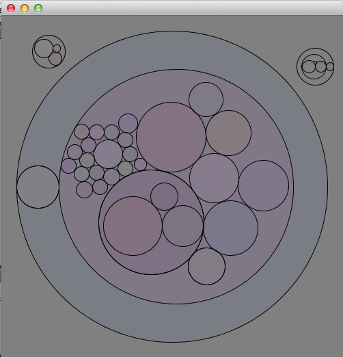

# ballsack

Two ways to use ballsack:

Interactive mode:
drag out circles (balls)
draw a circle around existing circles (sack)
repeat!

Xml File Visualizer:
Drag and drop an xml file into the window
On drop, ballsack will visualize the xml doc as balls and sacks

Notes: You can resize the window and press backspace to clear,
but you can't scale or position anything dragged in ...yet.

MIT license applies to all files in this project to date. Re-use enjoy.
