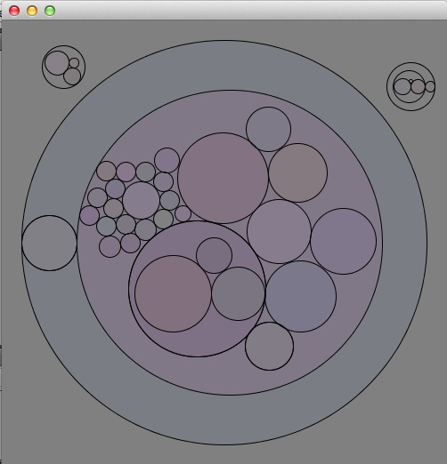

# ballsack

Two ways to use ballsack:

Interactive mode:
drag out circles (balls)
draw a circle around existing circles (sack)
repeat!

Xml File Visualizer:
Drag and drop an xml file into the window
On drop, ballsack will visualize the xml doc as balls and sacks

Notes: You can resize the window and press backspace to clear,
but you can't scale or position anything dragged in ...yet.

MIT license applies to all files in this project to date. Re-use enjoy.

Python Port (color GUI + drag and drop):

1. Install dependency:
	pip install pygame
2. Run:
	python3 ballsack_gui.py

Controls:
- Drag on empty space to create circles.
- Draw around existing circles to condense them into a sack.
- Drag circles/sacks to move them.
- Drop an XML file onto the window to visualize it.
- Press Ctrl+O to pick an XML file if desktop drag-and-drop does not work.
- Press Backspace to clear.
